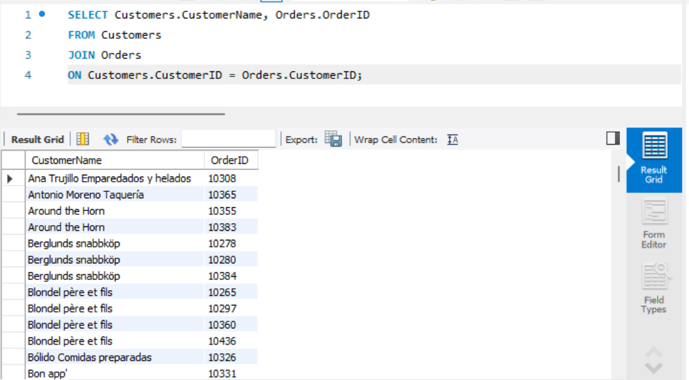
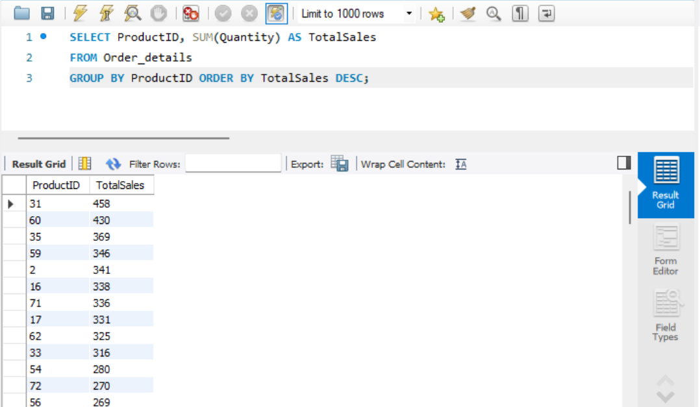

# SQL Retail & Sales Data Analysis Project

This project was completed as part of a **Data Technician Bootcamp** and focuses on analysing retail and sales data using **SQL and MySQL**.

The project uses the **Northwind database** to practise writing queries that retrieve, filter, and analyse business data. Through a series of SQL scripts, the project demonstrates how structured queries can be used to extract insights from relational databases.

---

# Project Overview

Using the Northwind sample database, this project explores how SQL can be used to analyse retail and sales data. Queries were written to retrieve customer information, combine data across tables, and summarise sales metrics.

The project demonstrates how SQL can transform raw database tables into meaningful insights through filtering, aggregation, and relational joins.

---

# SQL Skills Demonstrated

This project demonstrates several core SQL skills including:

- Writing **SELECT queries** to retrieve data
- Filtering data using **WHERE clauses**
- Sorting results using **ORDER BY**
- Aggregating data using **GROUP BY**
- Using aggregate functions such as:
  - `SUM()`
  - `COUNT()`
  - `AVG()`
- Performing **table joins** to combine data from multiple tables
- Analysing relational datasets to extract business insights

---

# Example SQL Queries

## Basic SELECT Query


This query retrieves all customer records from the **Customers** table in the Northwind database. It demonstrates how SQL can be used to access and display data stored in a relational database.

---

## JOIN Query



This query joins the **Customers** and **Orders** tables using the `CustomerID` field. Joins allow related data from multiple tables to be combined, enabling deeper analysis of customer orders and transaction activity.

---

## GROUP BY and ORDER BY Query



This query calculates total sales quantities for each product using `SUM(Quantity)` and groups the results by `ProductID`. The results are then sorted in descending order using `ORDER BY`, helping identify the best-performing products.

---

# Dataset

This project uses the **Northwind database**, a commonly used sample dataset that represents a fictional company managing orders, customers, suppliers, and products.

The database structure allows users to practise working with relational data and performing business-style analysis using SQL.

---

# Tools Used

- **SQL**
- **MySQL Workbench**
- **Northwind Sample Database**
- **SQLBolt practice exercises**

---

# Repository Structure

```
My-SQL-Repository
│
├── Week_3_Databases_and_SQL_Workbook.docx
├── Northwind Database create.sql
├── Northwind Database Basic Queries.sql
├── Northwind Classwork Joins and Group By.sql
├── select-query.png
├── join-query.png
├── group-by-query.png
└── README.md
```

---

# Learning Outcomes

Through this project I developed skills in:

- Writing SQL queries to retrieve and analyse data
- Working with relational database structures
- Combining tables using joins
- Summarising data using aggregate functions
- Using SQL to extract insights from retail and sales datasets
